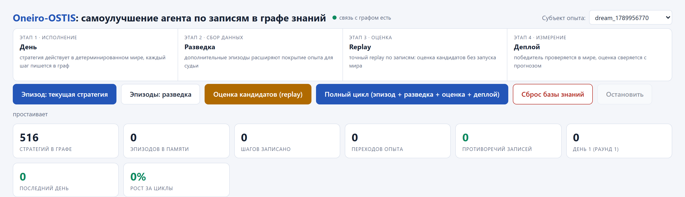
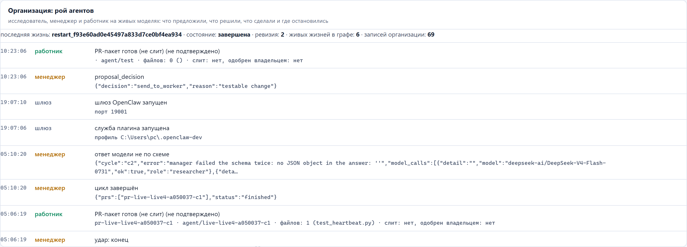
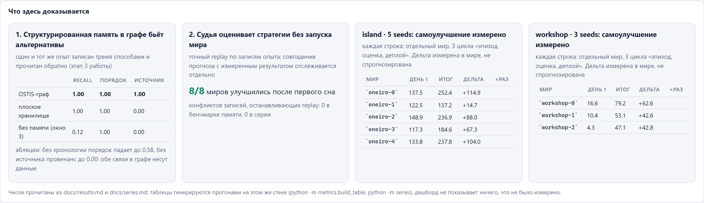

<!--
ИСТОЧНИК ДОКУМЕНТА.
Этот файл это текст работы. Word-версия собирается командой:
    python scripts/pz-build.py
Править надо здесь, а не в docx: docx перезаписывается целиком при сборке.
Пометки в квадратных скобках (например [ФАМИЛИЯ ИМЯ ОТЧЕСТВО]) заполняются вручную
на титульном листе, в тексте они не встречаются.
Все числа в тексте взяты из артефактов на диске; артефакты перечислены в
приложении В, чтобы каждое число можно было проверить.
-->

<!--
ТИТУЛЬНЫЙ ЛИСТ. Порядок строк задан требованием конкурса: название работы
заглавными буквами по центру, ниже автор и руководитель, ниже учреждение
образования по правому краю курсивом. Пометки в квадратных скобках заполняются
вручную. Сборщик docx читает строки АВТОР:, РУКОВОДИТЕЛЬ:, УЧРЕЖДЕНИЕ:, МЕСТО:
по этим ключам, поэтому порядок строк здесь можно менять свободно.
-->
# Oneiro-OSTIS: самоулучшение агента по записям в графе знаний

АВТОР: [ФАМИЛИЯ ИМЯ ОТЧЕСТВО], [класс]

РУКОВОДИТЕЛЬ: [ФИО руководителя]

УЧРЕЖДЕНИЕ: [УЧРЕЖДЕНИЕ ОБРАЗОВАНИЯ]

МЕСТО: [населённый пункт], 2026

## Введение

**Тема работы.** Самоулучшение агента по записям в графе знаний на примере системы Oneiro-OSTIS.

**Проблема.** Современные агентные системы (программы, в которых языковая модель сама вызывает инструменты: читает файлы, правит код, запускает проверки) не сохраняют свой опыт в виде, пригодном для повторного использования. Каждый следующий запуск начинается с нуля: агент снова тратит запросы на то, чтобы понять задачу, снова повторяет уже сделанные ошибки, а улучшать его поведение приходится повторными прогонами, каждый из которых стоит времени и денег. Прошлый опыт при этом остаётся в виде текстовых журналов, из которых нельзя ни восстановить порядок событий, ни понять, откуда взялось утверждение, ни проверить, что именно привело к успеху.

**Цель работы.** Построить систему, в которой опыт агента хранится как типизированные записи в графе знаний, используется для самоулучшения и измеряется честно, то есть так, чтобы каждое заявленное число можно было воспроизвести из записи на диске.

**Задачи.**

1. Описать онтологию опыта и реализовать запись полной траектории действий агента в граф знаний OSTIS.
2. Реализовать механизм самоулучшения («сон»): порождение стратегий-кандидатов и отбор победителя точным повтором записанного опыта, без исполнения среды.
3. Перенести цикл с модельного мира на реального кодирующего агента и искать улучшение в его обвязке, то есть в том, что агенту показывают и когда он останавливается.
4. Ввести замороженные правила приёмки результата и измерение в рабочем режиме с повторами, чтобы отделить настоящую экономию от шума измерений.
5. Сравнить граф знаний как память с плоским журналом и с полным отсутствием памяти на публичном наборе задач.
6. Собрать автономный цикл из трёх ролей (исследователь, менеджер, работник), который работает в изолированных рабочих копиях, оставляет готовые к проверке человеком изменения и переживает перезапуск процесса.
7. Описать практическое применение системы: сценарий долгого проекта, сценарий повседневной работы и требования к запуску.

**Практическая ценность.** Система это не только метод измерения, но и работающий помощник. Опыт, накопленный как типизированные записи, превращает языковую модель из собеседника в сотрудника: помощник помнит сделанное раньше, продолжает прерванную работу после перезапуска и отчитывается о каждом шаге записями, а не пересказом. В работе разобраны два практических сценария: долгий проект, где агент сам находит слабости, готовит изменение в изолированной копии и оставляет его человеку на одобрение, и повседневная работа школы или офиса, где помощник разбирает входящие, сводит данные в таблицы и присылает отчёты в мессенджер.

**Объект исследования.** Процесс накопления и использования опыта автономным агентом. **Предмет исследования.** Способы хранения опыта и отбора улучшений, а также измеримость их пользы.

**Методы.** Эксперимент на детерминированной среде; точный повтор записанных траекторий; сравнение вариантов при постоянной модели; измерение в рабочем режиме с повторами; сопоставление с публичным набором задач и с контрольными вариантами.

**Новизна (в границах выполненного поиска).** Поиск по четырём статьям-ориентирам и по экосистеме OSTIS не нашёл работы, которая одновременно: (а) записывает полную траекторию агента как элементы sc-графа с онтологией, (б) улучшает агента точным повтором собственных записей, (в) измеряет победителя в рабочем режиме и (г) возвращает доказательства обратно в граф. Это утверждение о границах выполненного поиска, а не заключение патентной экспертизы.

**Обоснование необходимости работы.** Оно не в том, что метод уже работает везде, а в том, что он честно измерен. Из одиннадцати раундов поиска переносимую экономию дал один: минус 13,3 процента запросов на поисковом наборе задач и минус 28,5 процента на отложенном наборе. Первые десять раундов либо ничего не развернули, либо развернули улучшение, которое следующее измерение опровергло. Именно эта история и составляет результат: правила приёмки в системе пересматривались пять раз, и каждый раз их меняло измерение, а не мнение автора.

## Глава 1. Состояние вопроса и место работы

### 1.1. Рекурсивное самоулучшение агентов

Под рекурсивным самоулучшением понимают ситуацию, когда система сама создаёт изменения, которые повышают её же способность решать задачи. У этого направления два уровня. Первый, более обсуждаемый, касается изменения самой модели: её весов, данных обучения, процедуры дообучения. Второй, менее заметный и гораздо более доступный для школьного исследования, касается изменения **обвязки**: кода вокруг модели, который решает, что модели показать, что сохранить, когда остановиться. Языковая модель в этом случае не меняется вовсе, а меняется то, как с ней обращаются.

Наша работа относится ко второму уровню и добавляет к нему память: изменения отбираются не по ощущению, а по записанному опыту, и сам опыт лежит в структурированном виде.

### 1.2. Четыре работы, задающие метод

Четыре статьи задают рамку, в которой мы работаем. Ниже: их вклад и то, что взято нами.

**Dream-RSI.** Основной тезис: накопленная история уже является симулятором мира, поэтому стратегии можно искать на записях, не запуская среду заново. Это исходный образец нашего цикла: днём агент действует и записывается, во время простоя предлагаются альтернативные стратегии и оцениваются на записанном дереве опыта.

**Meta-Harness.** Показывает, что объект поиска это обвязка агента, а не политика модели, и что предложитель, которому дают полные траектории, работает лучше того, кому дают краткие пересказы. Отсюда наше решение хранить записи целиком и передавать предложителю траектории, а не сводки.

**SoL-Pi.** Рекурсивное масштабирование цикла автоматического исследования на уровне обвязки. Два важных для нас элемента: правила приёмки фиксируются **до** поиска, и часть задач держится вне поискового набора. Обе идеи перенесены в наш цикл.

**GAVEL.** В робототехнике показывает, что явная символьная модель (отношения объектов, условия применимости действий) позволяет бесплатно проверять и починять планы, оставляя дорогую работу языковой модели только для ошибок, требующих смыслового вывода: 3,4 запроса против одной проверки моделью. Это ровно то разделение обязанностей, которое есть у нас между бесплатным судьёй по записям и платным измерением в рабочем режиме.

### 1.3. Память как измеряемая величина

Утверждение «структурированная память лучше плоской» проверяемо только на публичном наборе. Такой набор есть: LongMemEval, 500 вопросов к долговременной памяти диалогового ассистента, шесть типов вопросов (обновление знаний, многосессионные, временные рассуждения, вопросы по одному сообщению пользователя и ассистента, предпочтения). Набор содержит протокол автоматической проверки ответа отдельной моделью-судьёй; мы используем их протокол, а не собственный, чтобы результат можно было сравнить с опубликованным.

### 1.4. Граф знаний OSTIS как носитель опыта

OSTIS это открытая технология проектирования интеллектуальных систем, в которой база знаний является не хранилищем записей для программы, а самой программой: элементы знаний, отношения между ними и агенты, обрабатывающие эти элементы, живут в одном семантическом графе. Практически это означает, что онтология является исходным текстом, машина собирает базу знаний из него при запуске, а сам граф доступен для обзора человеком через веб-интерфейс. Для нашей задачи это даёт три вещи: типизированные отношения (время и происхождение записи это не поля в строке журнала, а связи графа), расширяемость онтологии без пересборки, и наглядность: то, что накопила система, можно открыть и посмотреть.

### 1.5. Чем наша работа отличается и куда движется

Отличие от четырёх работ: дерево опыта у нас это типизированный семантический граф с онтологией и запросами к связям, а не каталог файлов и не текстовые журналы; правила приёмки замораживаются до поиска и версионируются по раундам, и цикл умеет перепроверять собственные прежние решения по более поздним правилам; судья по записям доказуемо бесплатен на тех шагах, которые он покрывает (восстановление запросов посимвольно, проверка отсутствия исполнений в тестах).

Границы этой части обозначены точно: набор задач у нас шесть небольших против пятидесяти одной у SoL-Pi, а публичный замер памяти, сравнивающий граф с плоским журналом, дал равный итог в среднем по набору и разницу в пользу графа на вопросах о времени (см. 4.3 и приложение А), поэтому прямой замер влияния вида памяти на результат работы впереди. По практическому применению эта работа идёт дальше перечисленных: предмет работы помощника выходит за пределы кода (см. главу 3).

## Глава 2. Архитектура системы

### 2.1. Граф знаний и онтология опыта

Опыт хранится как элементы графа. Понятия онтологии: попытка (`Attempt`) с действием, объектом и числовым исходом, стратегия (`Strategy`) с описанием и измеренным результатом, эпизод, шаг, состояние, а также связи времени и причинности. Отдельные классы описывают поиск по обвязке реального агента: политика (`HarnessPolicy`) несёт описание обвязки, оценку судьи, решение правил приёмки и результат измерения; раунд (`HarnessRound`) несёт правила, действовавшие в этом раунде.

Запись и выборку выполняют агенты на C++ (по одной операции на действие: записать попытку, выбрать попытки, повторить поддерево, развернуть стратегию), а обогащение записи полями, которые нужны повтору (индекс шага, состояние, список допустимых действий, стратегия), выполняет мост на Python. Прикладной код на Python только на этом уровне и общается с графом, что позволяет держать онтологию в одном месте.

### 2.2. Детерминированный мир и точный повтор

Первая площадка это детерминированный мир: островная экспедиция из девяти локаций и восьми точек раскопок с бюджетом в сорок шагов, где ценность доставленного предмета зависит от точки доставки (множители 1,0, 1,2 и 1,5). Мир воспроизводим: значения выводятся из зерна и хеша, обращения к часам и к порядку хеширования внутри процесса отсутствуют, что закреплено отдельным тестом.

Точный повтор (реплей) работает только по записям и никогда не исполняет мир. Переходы индексируются по признаку, который в этом мире полностью определяет исход (локация, несомый предмет, число уже взятых предметов с текущей точки) вместе со действием. На каждом шаге кандидат выбирает одно из записанных допустимых действий; если это действие встречалось в дереве, берётся записанный исход и обход продолжается от состояния-продолжения; если действие не записано, эпизод усекается и помечается как непокрытый. Судья никогда не додумывает исход. То, что повтор не исполняет мир, проверяется тестом, в котором шаг мира подменён функцией, обязанной возбудить исключение.

Отдельно измеряется доля шагов, которые удалось восстановить точно, и доля оценённых: она возвращается как первое по важности число, потому что оценка на непокрытых шагах это уже не измерение, а догадка.

### 2.3. Поиск по обвязке реального агента

Вторая площадка это настоящий кодирующий агент, наш собственный цикл инструментов (список файлов, чтение, запись, правка, запуск тестов, запуск команды). Обвязка описана одиннадцатью полями: список файлов, начальный вывод тестов, режим контекста, ширина окна шагов, длина наблюдения, бюджет чтения строк, бюджет шагов, возвращаются ли падающие тесты, температура. Задачи: шесть небольших задач на Python, у каждой видимые тесты и скрытый файл тестов, которого агент не видит; четыре задачи образуют поисковый набор, две отложены и не участвуют в отборе.

Судья по записям восстанавливает не только стоимость, но и сами сообщения, которые кандидат отправил бы модели. На шести записях промпты восстановлены посимвольно, 6 из 6 (33 шага), а модель подсчёта токенов проверена перекрёстно: средняя относительная ошибка 5,9 процента, худшая 17,3 процента.

### 2.4. Живой цикл из трёх ролей

Третья площадка это организационный цикл. Исследователь читает досье проекта и предлагает от двух до четырёх вариантов работы. Менеджер выбирает ровно один вариант с критериями приёмки либо останавливает цикл. Работник выполняет правку в отдельной копии репозитория (git worktree) на отдельной ветке, запускает разрешённую проверку из белого списка и оставляет пакет изменений. Ничего не вливается, не отправляется на сервер и не утверждается автоматически: пакет ждёт человека. Каждый цикл пишет записи в тот же граф знаний, и цикл читает этот журнал перед следующим предложением, чтобы не предлагать сделанное.

Цикл переживает смерть процесса: при перезапуске с тем же именем прогона биография получает запись о перезапуске, журнал получает запись о возобновлении, а рабочая копия встаёт рядом с остатками прерванной попытки и не сталкивается с ними.

### 2.5. Панель управления и границы автоматизации

Состояние системы видно на панели (локальный веб-сервер): лента организации с ролями, предложениями, решениями менеджера, пакетами и причинами остановок; раздел памяти с результатами публичного замера; раздел, в котором прямо перечислено, что именно доказано текущим прогоном.

Границы автоматизации важнее возможностей, поэтому они перечислены в самой системе: ни один пакет не вливается сам; запуск цикла и его продолжительность задаёт человек; провайдер языковых моделей один, и отказ провайдера записывается как «не измерено», а не как ошибка системы.

Развитие цикла идёт по одному направлению: перенести чтение записей внутрь графа на всех площадках, включая поиск по обвязке, где записи сейчас читаются с диска и попадают в граф уже после отбора. Тогда память агента станет одинаковой и в модельном мире, и в живой работе.

## Глава 3. Практическое применение

### 3.1. Чем эта система отличается от чата с языковой моделью

Три отличия определяют практику.

**Она помнит.** Опыт каждой сессии ложится в граф знаний типизированными записями: что было предложено, что решено, что сделано, каким числом закончилось. Новая сессия начинается не с чистого листа, а с разбора журнала, поэтому агент не предлагает дважды одно и то же и не повторяет ошибок, которые уже были записаны.

**Она длится.** Цикл переживает смерть процесса: биография получает запись о возобновлении, журнал знает, на чём остановилась работа, а рабочая копия встаёт рядом с остатками прерванной попытки и не сталкивается с ними. Помощник, который продолжает работу после выключения машины, стоит несопоставимо дороже ассистента, который каждый раз знакомится заново.

**Она отчитывается.** Каждый шаг оставляет запись: журнал организации на панели показывает роли, предложения, решения, пакеты изменений и причины остановок. Отчёт не сочиняется моделью напоследок, он собирается из записей, и любую строку можно раскрыть до источника.

Предмет работы при этом меняется свободно. Двигатель один: роли, память, изолированная работа, проверки и отчёт человеку. Меняется только то, что помощнику поручено.

### 3.2. Долгий проект: агент, который не бросает работу

Сценарий: человек или небольшая команда ведёт проект месяцами, и рутина вокруг него съедает больше времени, чем сама работа. Один цикл агента устроен так.

1. **Исследователь** читает досье проекта (состав кода, открытые задачи, журнал прошлых циклов, заявленные цели) и предлагает от двух до четырёх вариантов работы, каждый с доказательством: где именно слабость и чем её видно.
2. **Менеджер** выбирает ровно один вариант, называет проверки, по которым результат будет принят, либо останавливает цикл с записанной причиной.
3. **Работник** берёт изолированную копию репозитория на отдельной ветке, вносит минимальную правку, запускает разрешённую проверку из белого списка и собирает пакет изменения.
4. **Человек** получает пакет и решает. Ничего не вливается, не отправляется на сервер и не утверждается автоматически.

Что это даёт на практике. Поиск слабостей и черновая правка уходят агенту, а решение остаётся за человеком. Незавершённая работа не теряется между сессиями. Следующий цикл не повторяет предыдущий, потому что читает журнал. Разбор примера из живого журнала: исследователь нашёл, что сканер маркеров незакрытых задач в собственном коде проекта помечает собственные же строки реализации, менеджер выбрал именно это предложение как подтверждённую слабость, работник исправил определение маркера в изолированной копии и оставил пакет с прогоном проверок. Пять таких пакетов лежат в журнале проекта, включая один после перезапуска процесса.

### 3.3. Повседневная работа: учитель, завуч, секретарь

Тот же двигатель закрывает рутину, не имеющую отношения к программированию. Помощник берёт входящий поток и превращает его в готовые документы.

| Что поручают | Что получают на выходе |
|---|---|
| Почта и сообщения | входящие разобраны; требующее ответа отделено от информационного; поручения с исполнителями и сроками; черновики ответов |
| Списки и таблицы | разрозненные данные сведены в одну таблицу по заданной форме; итоги посчитаны; расхождения и дубли найдены |
| Отчёты и напоминания | отчёт по шаблону без пропущенных пунктов; напоминание о сроке заранее; готовый текст, отправленный туда, где человек его прочитает |
| Повторяющиеся документы | справки, выписки, письма по образцу с подставленными данными |

Почему это не делает обычный чат с языковой моделью: здесь важна не удачная формулировка, а ведение потока неделями. Нужно помнить, что было в прошлый раз, кто что обещал, какой срок подходит, что уже отправлено. Результат определяют память и длительность, а не красноречие. Доступ к данным выставляет человек: помощник видит только то, что ему открыли, а отправка наружу (письмо, сообщение в мессенджер, файл) остаётся за человеком до тех пор, пока он сам не разрешит обратное.

### 3.4. Что нужно для запуска

Требования к машине скромные: интерпретатор Python, локальный стек графа знаний в контейнере, доступ к языковым моделям через локальный прокси с ключами. Панель управления поднимается одним процессом на локальном порту, и вся работа видна в браузере на той же машине.

Порядок запуска: поднять стек графа знаний, запустить прокси моделей, запустить панель, выбрать субъект опыта и нажать кнопку нужного этапа (эпизод, разведка, оценка кандидатов, полный цикл). Отдельно настраивается шлюз расширения, который превращает сессии внешнего агента в записи того же графа, поэтому опыт не распадается на две базы.

## Глава 4. Метод измерения и результаты

### 4.1. Как измеряется улучшение

Правила приёмки формулируются до поиска и не меняются внутри раунда; каждое их изменение вызывалось конкретным измерением, которое предыдущая версия пропустила. Правил было пять версий.

| Версия | Что добавлено | Что вынудило |
|---|---|---|
| v2 | требование покрытия: экономия признаётся, только если решения кандидата восстановимы | раунды 2 и 3 развернули улучшения при 0 восстановленных решениях из 26, и оба оказались хуже |
| v3 | путь измерения в рабочем режиме для кандидатов, которых повтор не судит | три кандидата с прогнозом от +22,5 до +26,6 процента и без единого восстановленного решения |
| v4 | политика, меняющая то, что агент видит, обязана измеряться в рабочем режиме независимо от покрытия | контрольная политика `window3`: прогноз +7,6 процента при покрытии 72,7 процента, измерение дало +12,4 процента хуже, а на отложенных задачах +81,8 процента хуже |
| v5 | три прогона на задачу вместо одного, прежде чем называть число | раунд 9: одно измерение дало минус 3,4 процента, три повтора дали плюс 4,0 процента |

Измерение в рабочем режиме дорого, поэтому перед каждым раундом судья решает большинство кандидатов бесплатно, а платят только за тех, кого судья не смог оценить или кто меняет поведение агента. Шум самого провайдера проверен контрольной политикой: одна и та же обвязка при повторах даёт разброс около плюс-минус 20 процентов, поэтому одиночный прогон не доказывает ничего.

### 4.2. Сон в детерминированных мирах

Восемь независимых прогонов (пять зёрен островного мира, три зерна мастерской, по три раунда), измеренных в самом мире, а не по оценке судьи:

| Мир | Улучшилось | Средний прирост | Отношение | Смещение судьи | Конфликты записей |
|---|---|---|---|---|---|
| Остров, 5 зёрен | 5 из 5 | +77,8 | 1,58x | +56,9 (около 29,7 процента) | 0 |
| Мастерская, 3 зерна | 3 из 3 | +49,3 | 6,97x | +11,3 (около 22,9 процента) | 0 |

Все восемь зёрен улучшились после одного сна; самый скромный выигрыш это +14,7 (зерно `oneiro-1`), и он принимается как честная нижняя граница метода на этом мире. Оценка судьи при этом завышает результат на 22 до 30 процентов относительно измеренного: судья хорошо упорядочивает кандидатов и не годится как предсказание. Это ограничение важнее самого успеха, и оно перенесено в правила приёмки.

### 4.3. Что сохраняет граф знаний

Прямой замер памяти на одном эпизоде из 25 записанных попыток, с отключением отдельных видов связей:

| Память | Полнота | Порядок | Происхождение |
|---|---|---|---|
| только контекст (окно из трёх шагов) | 0,12 | 1,00 | 0,00 |
| плоское хранилище (неупорядоченный список) | 1,00 | 1,00 | 0,00 |
| граф OSTIS | 1,00 | 1,00 | 1,00 |
| граф без связей времени | 1,00 | 0,58 | 1,00 |
| граф без связей происхождения | 1,00 | 1,00 | 0,00 |
| случайная выборка (нижняя граница) | 0,00 | 0,00 | 0,00 |

Чтение таблицы: чтобы просто **помнить**, граф не нужен, плоский список даёт такую же полноту. Граф нужен, чтобы сохранить **порядок** (без связей времени согласованность соседних пар падает до 0,58) и **происхождение** (без этих связей признак источник-вид не переживает выборку вовсе). Это сильнейшее имеющееся у нас свидетельство того, что структура несёт нагрузку, и одновременно самое слабое место: замер сделан на одном эпизоде, и он измеряет качество выборки, а не влияние на результат работы.

Проверка на публичном наборе LongMemEval (детали в приложении А) равна по итогу: плоский журнал 72,7 процента, граф 72,1 процента, без памяти 4,1 процента. Разница между двумя видами памяти внутри шума, а разделение по типам вопросов показывает, где именно структура помогает: на вопросах о времени граф даёт 40,0 процента против 16,7 у плоского журнала, а на многосессионных вопросах проигрывает (58,3 против 66,7). Полный контекст без всякой выборки даёт до 94 процентов, то есть сама задача для нашей модели разрешима, и упрощать её мы не стали.

### 4.4. Поиск по обвязке: одиннадцать раундов

Одиннадцать раундов, 29 предложенных кандидатов, четыре развёртывания. Результат первых десяти: ни одного, которое пережило бы честное измерение.

| Раунд | Кандидатов | Итог |
|---|---|---|
| 1 | 3 | ничего не развёрнуто |
| 2 | 3 | развёрнуто; в рабочем режиме **+27,0 процента** (хуже) |
| 3 | 2 | развёрнуто; в рабочем режиме **+21,1 процента** (хуже), одна задача потеряна |
| 4 | 3 | отказ по доказательствам: у всех кандидатов 0 процентов восстановленных решений |
| 5-7 | 8 | ни один не прошёл порог экономии |
| 8 | 3 | измерено и отклонено: прогноз +32,0 процента, измерение +1,5 процента |
| 9 | 3 | развёрнуто по одному прогону на задачу (минус 3,4 процента); при трёх прогонах плюс 4,0 процента, переноса нет |
| 10 | 3 | ни один не прошёл порог |
| 11 | 1 | развёрнуто: поиск **минус 13,3 процента**, отложенные задачи **минус 28,5 процента**, переносится |

Раунд 11 это единственная защищаемая экономия за всю историю. Политика в нём состоит из двух полей: отсутствие начального вывода тестов в первом запросе и более длинные наблюдения инструментов (1500 символов вместо 1000). По отдельности ни одно поле не работает (первое поле в одиночку дало плюс 27 процентов в раунде 2), работает только их сочетание, и установить это можно было только измерением в рабочем режиме.

За одиннадцать раундов потрачено 26 прогонов в рабочем режиме; если бы каждого из 29 кандидатов измеряли один раз на каждой поисковой задаче, потребовалось бы 116 прогонов. Экономия 90 прогонов (в 4,5 раза) на пути к этим решениям и есть экономический аргумент метода.

Из девятнадцати отклонённых кандидатов большинство отклонено бесплатно, по записям. Судья ошибался в обе стороны: на семи написанных вручную обвязках его оценка расходилась с измерением от минус 43 до плюс 26 процентов.

### 4.5. Живой цикл: что подтверждено в графе

Живая запись в графе знаний на момент подготовки работы содержит 69 записей организации: 4 запуска цикла, 6 циклов, 6 наборов предложений и 6 решений менеджера, 6 созданных рабочих копий, 5 записей о пакетах изменений, 1 запись о возобновлении после перезапуска, 3 записи о запуске шлюза расширения и по одной записи о срыве цикла и о срыве heartbeat.

Из пяти записей о пакетах четыре принадлежат живым прогонам, а одна оставлена проверкой расширения шлюза (имя ветки содержит слово `test`, изменённых файлов ноль). Записи не удаляются: журнал показывает и рабочие циклы, и испытания, потому что этим он и отличается от отчёта, сочинённого в конце.

Срывы тоже названы: цикл сорвался один раз, когда провайдер отдал ошибку соединения, страховая модель ответила не по схеме, менеджер записал ошибку схемы, и цикл был пропущен без заморозки системы.

## Заключение

Поставленные задачи решены в следующем объёме.

Онтология опыта описана и работает: полная траектория агента, включая состояния, допустимые действия и числовые исходы, записывается в граф знаний, и связи времени и происхождения в нём проверены отключением (задача 1). Механизм самоулучшения реализован и измерен на двух структурно разных мирах: восемь из восьми зёрен улучшились после одного сна, от +14,7 до +114,9 (задача 2). Цикл перенесён на реального кодирующего агента; судья по записям восстанавливает запросы посимвольно, а правило «политику, меняющую поведение, измерять в рабочем режиме» появилось именно на этом переносе (задача 3). Правила приёмки заморожены и пересматривались пять раз, каждое изменение вынуждено измерением; измерение с тремя повторами отделило настоящую экономию от шума провайдера в плюс-минус 20 процентов (задача 4). Память сравнена на публичном наборе с плоским журналом и без памяти; подстройка под известный протокол судьи сохранена (задача 5). Автономный цикл из трёх ролей работает, переживает перезапуск процесса и оставляет незалитые пакеты изменений с доказательствами (задача 6). Практическое применение описано двумя сценариями, для долгого проекта и для повседневной работы, вместе с требованиями к запуску (задача 7).

**Практический итог.** Система работает как помощник, а не как лабораторная демонстрация. Она ведёт цикл из трёх ролей, помнит свою работу записями в графе, продолжает её после перезапуска процесса и оставляет человеку готовые к проверке пакеты изменений. Опыт, записанный с онтологией, позволяет отбирать улучшения почти бесплатно: из 29 предложенных кандидатов 19 отклонены по записям без единого запуска, а один развёрнутый вариант дал переносимую экономию запросов на реальном агенте. Память сравнена с плоским журналом и с полным отсутствием памяти на публичном наборе: без памяти 4,1 процента, с памятью около 72 процентов, а структура графа выигрывает там, где она и должна выигрывать: на вопросах о времени (40,0 против 16,7 процента) и на сохранении порядка и происхождения записей.

Отсюда ближайшие направления работы. Первое: довести до конца канал, которым система сама сообщает о решении человеку, чтобы отчёт приходил в мессенджер, а не ждал в журнале. Второе: расширить предмет работы за пределы кода (почта, таблицы, документы по образцу), потому что помощник в повседневной работе школы и офиса это тот же двигатель с другим предметом. Третье: перенести чтение записей внутрь графа на всех площадках, включая поиск по обвязке, чтобы память агента была одинаковой в мире и в живой работе. Четвёртое: расширить набор задач с шести до двенадцати и более и повторить замер памяти, чтобы разница между видами памяти перестала быть в пределах шума.

## Список использованных источников

1. Голенков В.В., Гулякина Н.А. Открытая семантическая технология проектирования интеллектуальных систем (OSTIS) // Сборник научных трудов OSTIS. Минск, 2023. URL: https://proc.ostis.net/proc/Proceedings%20OSTIS-2023.pdf (дата обращения: 22.09.2026).
2. Голенков В.В. и др. Интеллектуальные компьютерные системы нового поколения // Доклады БГУИР. 2024. URL: https://doklady.bsuir.by/jour/article/view/3906 (дата обращения: 22.09.2026).
3. Технология OSTIS: программная платформа (sc-machine, sc-web, py-sc-client). URL: https://github.com/ostis-ai (дата обращения: 22.09.2026).
4. Dream-RSI: накопленная история как симулятор для поиска стратегий. arXiv:2609.14858 (текст статьи передан руководителю работы).
5. Meta-Harness: оптимизация обвязки агента по полным траекториям. arXiv:2603.28052 (текст статьи передан руководителю работы).
6. SoL-Pi: рекурсивное масштабирование автоматического исследования на уровне обвязки. arXiv:2609.20519 (текст статьи передан руководителю работы).
7. GAVEL: явная символьная модель мира для проверки и починки планов. arXiv:2609.19315 (текст статьи передан руководителю работы).
8. Wu D. et al. LongMemEval: Benchmarking Chat Assistants on Long-Term Interactive Memory // arXiv:2410.10813, 2024. URL: https://arxiv.org/abs/2410.10813 (дата обращения: 22.09.2026).
9. Материалы проекта Oneiro-OSTIS: описание цикла по обвязке (`docs/harness.md`), замер памяти (`bench/memory/README.md`), живой организационный цикл (`docs/GOAL-LIVE-SWARM.md`), полный контекст проекта (`docs/PROJECT-CONTEXT.md`).

## Приложение А. Замер памяти на публичном наборе LongMemEval

Набор: LongMemEval, исправленная авторами версия (`longmemeval-cleaned`), 50 вопросов из 500, шесть типов. Стадии: `oracle` (в наборе только те сессии, где содержится ответ) и `s` (полные истории, выборка ограничена 100 сессиями с обязательным сохранением сессий с ответом). Порядок вариантов одинаков на всех стадиях: ответ дают те же модели, судью проводят те же модели, меняется только вид памяти. Разные модели-ответчики указаны отдельно, потому что потолок зависит именно от них.

Стадия `s` (настоящая выборка), прогон `s-50-1`:

| Вариант памяти | Проверено судьёй | Без вердикта | Пройдено | Доля верных | Полнота выборки |
|---|---|---|---|---|---|
| плоский журнал слов | 44 из 50 | 6 | 32 | 0,7273 | 0,8800 |
| граф (сначала время, потом похожесть) | 43 из 50 | 7 | 31 | 0,7209 | 0,8627 |
| без памяти | 49 из 50 | 1 | 2 | 0,0408 | не применимо |

Стадия `s`, разбивка по типам вопросов:

| Тип вопроса | Плоский журнал | Граф | Без памяти |
|---|---|---|---|
| обновление знаний | 0,8889 | 0,8889 | 0,1111 |
| многосессионные | 0,6667 | 0,5833 | 0,0000 |
| по одному сообщению ассистента | 1,0000 | 0,8333 | 0,0000 |
| предпочтения | 0,5000 | 0,5000 | 0,0000 |
| по одному сообщению пользователя | 1,0000 | 1,0000 | 0,1429 |
| временные рассуждения | 0,1667 | 0,4000 | 0,0000 |

Стадия `oracle`, два прогона с разными моделями-ответчиками (потолок зависит от отвечающей модели, поэтому числа приведены оба):

| Прогон | Вариант | Пройдено | Доля верных |
|---|---|---|---|
| `oracle-50-1` | полный контекст | 29 из 50 | 0,5800 |
| `oracle-50-1` | без памяти | 3 из 50 | 0,0600 |
| `oracle-50-2` | полный контекст | 47 из 50 | 0,9400 |
| `oracle-50-2` | без памяти | 2 из 50 | 0,0408 |

Оговорки, без которых эти числа цитировать нельзя. Первое: судья не вынес вердикт по 6 и 7 клеткам из 50 на стадии `s`; такие клетки не засчитаны ни как верные, ни как неверные, и в таблице они вынесены отдельным столбцом. Второе: вопросы о предпочтениях дали ноль на всех вариантах в прогоне `oracle-50-1`, то есть этот тип вопросов нашим стендом пока не измеряется. Третье: замер не финальный, разница между графом и плоским журналом лежит внутри шума, и именно поэтому в основном тексте не делается вывода о превосходстве графа.

## Приложение Б. Раунды поиска по обвязке

| Раунд | Правила | Кандидатов | Итог |
|---|---|---|---|
| 1 | v1 | 3 | ничего не развёрнуто |
| 2 | v1 | 3 | развёрнуто, в рабочем режиме +27,0 процента (хуже) |
| 3 | v1 | 2 | развёрнуто, +21,1 процента (хуже), одна задача потеряна |
| 4 | v2 | 3 | отказ по доказательствам |
| 5-7 | v3 | 8 | порог экономии не пройден |
| 8 | v4 | 3 | измерено и отклонено (прогноз +32,0, измерение +1,5) |
| 9 | v4 | 3 | развёрнуто по одному прогону (минус 3,4), при трёх прогонах +4,0 |
| 10 | v5 | 3 | порог не пройден |
| 11 | v5 | 1 | развёрнуто: минус 13,3 на поиске, минус 28,5 на отложенных задачах |

## Приложение В. Как проверить числа работы

Все числа основного текста берутся из артефактов, которые создаются запуском кода проекта. Пути указаны относительно каталога проекта.

| Что проверяется | Чем воспроизводится |
|---|---|
| Улучшение в мирах (пункт 4.2) | `docs/series.md` и `docs/results.md` (создаются прогоном серии по зёрнам) |
| Сохранение порядка и происхождения (пункт 4.3) | `python -m metrics.build_table` против живого стека |
| Оценка судьи и контрольные обвязки (пункт 4.4) | `python harness/rsi.py --reference` и `python harness/report.py` |
| Раунды и решения правил (приложения Б) | `python harness/rsi.py --show --recheck --ledger`; записи в `harness/lab/rsi/round-*.json` |
| Замер памяти (приложение А) | `python bench/memory/run.py --stage s --questions 50 --cap 100 --k 5`; отчёты в каталоге прогонов |
| Живой цикл (пункт 4.5) | `python python/life_loop.py --cycles 2`; лента на панели, раздел организации |
| Отсутствие исполнений в повторе | `python -m pytest tests/test_replay_offline.py -q` (шаг мира подменён функцией, обязанной возбуждать исключение) |
| Готовность кода (все проверки) | `python -m pytest tests -q --ignore=tests/test_core_loop.py` и `python -m pytest harness/tests -q`: 109 и 19 проверок, все проходят без обращения к сети |

## Приложение Г. Рисунки панели управления

Рисунок Г.1. Общий вид панели: состояние цикла, управление этапами, показатели.

Рисунок Г.2. Лента организации: предложения исследователя, решение менеджера, созданные рабочие копии, пакеты изменений и причины остановок.

Рисунок Г.3. Раздел памяти: сравнение видов памяти на публичном наборе и честное состояние замера.

Рисунок Г.4. Раздел «что здесь доказывается»: перечень утверждений, подтверждённых текущим прогоном, отдельно от утверждений, которые ещё не подтверждены.

Все четыре рисунка сняты с работающей панели скриптом `scripts/pz-shots.py`, поэтому их можно пересобрать заново, когда панель изменится. Рисунок роста счёта в мире в работу не включён: на момент съёмки он показывал пустое состояние, потому что панель ищет эпизоды деплоя в графе и не находит их там, где они записаны. Это дефект панели, а не отсутствие данных: сами раунды приведены таблицей в приложении Б.
